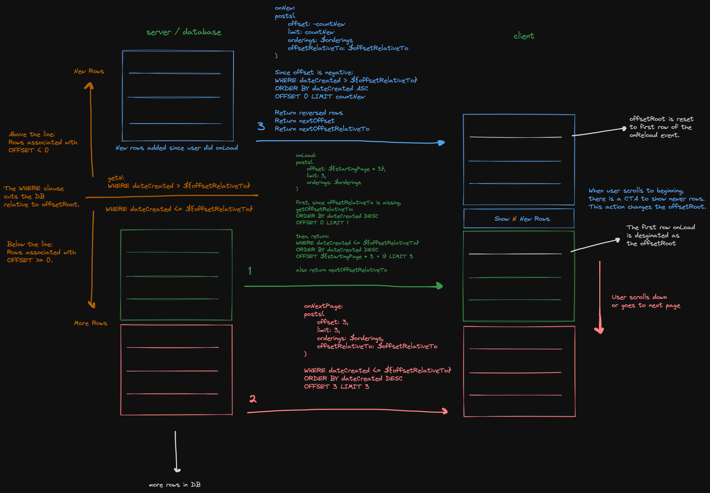

# graphql-directive-pagination

> Manipulates SQL clauses to provide pagination ability to fields in GraphQL. Easy to integrate.



This is similar to Relay's `@connection` directive (see [graphql-directive-connection](https://www.npmjs.com/package/graphql-directive-connection)). The difference is the use of `limit` and `offset` rather than `after, first, before, last`. The reason for this change is to integrate better with the LIMIT and OFFSET clauses in MySQL and PostgresQL.

In addition to a `@pagination` directive, this package is also bundled with JS functions to help you build the GraphQL resolvers that go along with your `@pagination` fields. 

# Instructions

Here are instructions on how to use this package to implement a paginated table or an infinite scroller.

It also supports scenarios where the data source has inserted new rows or documents while the client has already
started paginating/scrolling.

## Server-Side: TypeDefs

These are the changes you need to make to your existing typeDefs.

Steps:
* Import the paginationDirective.
* Add the `@pagination` directive definition either inlined into your typeDefs, or by including `paginationDirectiveTypeDefs` in `makeExecutableSchema`.
* Apply the transform to your schema using `paginationDirectiveTransform`.

```js
import paginationDirective from 'graphql-directive-pagination'
import { makeExecutableSchema } from '@graphql-tools/schema'

const { paginationDirectiveTransform, paginationDirectiveTypeDefs } = paginationDirective('pagination')

const typeDefs = `
  directive @pagination on FIELD_DEFINITION

  type User {
    userId: Int
    
    """
    The type given to a field tagged with @pagination does not matter.
    It will be overwritten.
    Any args already present, such as this orderBy arg, will be kept.
    """
    posts: [Post!]! @pagination
  }

  type Post {
    postId: Int
  }

  type Query {
    user: User
  }
`

const resolvers = {}
let schema = makeExecutableSchema({
  typeDefs,
  // You can also use this:
  // typeDefs: [typeDefs, paginationDirectiveTypeDefs]
  resolvers
})

// You must also pass your resolvers into the transform:
schema = paginationDirectiveTransform(schema, resolvers)

export default schema
```

When you run this script, the original typeDefs you define will be transformed in this manner:
* Append the needed Pagination, PaginationOrdering, and PaginationInfo object types.
* Any fields tagged with `@pagination` will be untagged since the transform has been applied.
* Any fields tagged with `@pagination` will have their return type changed to the Pagination type.

These types will be added to your schema:

```graphql
type PaginationInfo {
  # Tells whether or not there are more rows available.
  # You can get these rows by performing a new query after incrementing 
  # your client-side offset.
  # E.G. offset += limit
  hasMore: Boolean!
  
  # Tells whether or not there are new rows available. "New rows" are not
  # the same as "more rows".
  # See the section on New Rows.
  hasNew: Int!
  
  # In order to get new rows, 
  # the client should send a request with: 
  # offset: $minusCountNew, 
  # limit: $countNew,
  # offsetRelativeTo: $offsetRelativeTo
  countNew: Int!
  
  # The client should always accept these values.
  # E.G. onResponse:
  # offset = nextOffset
  # offsetRelativeTo = nextOffsetRelativeTo
  nextOffset: Int!
  # FYI, nextOffsetRelativeTo is equal to 
  # `JSON.stringify(node[0][orderings[0].index])`.
  # It is denormalized into the response so that the server is 
  # authoritative and there is less work to be done for those 
  # using this package.
  nextOffsetRelativeTo: String!
}

input PostPagination {
  nodes: [Post!]!
  info: PaginationInfo!
}

input PaginationOrdering {
  index: String!
  direction: String!
}
```

In addition, the User type has been modified:

```graphql
# Before:
type User {
  posts: [Post!]! @pagination
}

# After:
type User {
  posts(
    # offset can be negative. See the section on New Rows.
    offset: Int!,
    limit: Int!, 
    # countNewLimit is used when checking how many new rows there are. 
    # See the section on New Rows.
    countNewLimit: Int,
    # At least 1 ordering should be included.
    orderings: [PaginationOrdering!]!,
    # The number of rows the client has should be passed into countLoaded on every request.
    countLoaded: Int!
    # After the initial page load, the server will respond with
    # `nextOffsetRelativeTo`.
    # This value should be echoed back in subsequent requests.
    offsetRelativeTo: String
  ): PostPagination!
}
```

## Server-Side: Resolvers

This package comes with a built-in functions for building resolvers for `@pagination` fields.

Let's suppose you are refactoring a field which was already implemented using a regular array. Your typeDefs and resolvers looked like this originally:

```ts
// userSchema.js

export const typeDefs = `
  type User {
    posts: [Post!]!
  }
`

export const resolvers = {
  User: {
    posts: async (user, args, ctx, info): Promise<Array<Post>> => {
      const posts = await PostDB.getByUserId(user.userId)
      return posts
    },
  },
}
```

Now you want to make this a paginated field, so you add the `@pagination` directive, and this is how your resolvers would change:

```ts
// userSchema.js

export const typeDefs = `
  type User {
    posts: [Post!]! @pagination
  }
`

export const resolvers = {
  User: {
    posts: pagination(async (user, args, ctx, info): Promise<Array<Post>> => {
      // See the SQL Queries section for instructions on how to use `args.clauses.mysql`.
      const posts = await PostDB.getByUserId(user.userId, args.clauses.mysql)
      return posts
    }),
  },
}
```

The `pagination` function takes in your original resolver and provides it with `args.clauses` and converts the return value into a `PaginationPost`. You do not have to use `args.clauses`. See the [SQL Queries](#sql-queries) section for more details. 

## SQL Queries

This package is primarily designed for usage with MySQL or Postgres. By performing sorting, offsetting, and limiting in the database,
work is offloaded from the Node server so that it remains lightweight and performant.

If you use these, you can pass `args.clauses.mysql` or `args.clauses.postgres` into your SQL query builder.
This package will then manipulate the clauses to do things such as:
1. If no `offsetRelativeTo` is present in the request, it performs a SELECT to determine one.
2. Once an `offsetRelativeTo` is determined, it performs one SELECT to get paginated rows, I.E. rows associated with a non-negative offset.
3. Also using `offsetRelativeTo`, it performs another SELECT to lookahead and check if there are any rows associated with a negative offset. This is used to determine `countNew`.

For more information on the different between positive and negative offset rows, see the section on [New Rows](#new-rows).

If you do not use MySQL or Postgres, you can still use this package. The `pagination` function can detect if you use `args.clauses`, and it will behave differently dependeing on if you do or do not:
1. If you use `args.clauses`, then the `pagination` function expects your resolver to return an array which has already had sort, offset, and limit applied to it.
2. If you do not use `args.clauses`, then `pagination` expects an array which has not yet been sorted, offsetted, or limited. `pagination` will perform those operations on the returned array.

Both `args.clauses.mysql` and `args.clauses.postgres` have been SQL escaped/sanitized using `mysql.format`.

Here is an example of how you should edit your SQL queries to integrate with this package:

```js
/*
  `clauses` is passed in from the resolver's `args.clauses.mysql` or
  `args.clauses.postgres`.
  
  type Clauses = {
    mysql: {
      where?: string
      orderBy: string
      limit: string
    }
    postgres: {
      where?: string
      orderBy: string
      offset: string
      limit: string
    }
  }
* */
async function getPosts(userId: string, clauses: Clauses) {
  const query = sql`
    SELECT * FROM Posts
    WHERE userId = ${userId}
    ${clauses.where ? `AND ${clauses.where}` : ''} 
    ORDER BY ${clauses.orderBy}
    LIMIT ${clauses.limit};
  `
  const rows = await db.all(query)
  return rows
}
```

## Client-Side Events

In the client, you might have these three queries for the three kinds of events that can happen:
* Initial Page Load Event
  * When the page first loads. This package supports non-zero offsets on page load so that pagination can start on a specific starting page.
  * The server interprets requests which have `offsetRelativeTo: null` as a page load. It will establish the `offsetRelativeTo` and return it in the response as `nextOffsetRelativeTo`.
* Load More / Scroll Down Event
  * After the initial page load, `offsetRelativeTo` has been established, and now the client can load pages associated with positive offsets.
* Load New / Scroll Up Event
  * When new rows are added to the database, they might be associated with a negative offset, so the client needs this event to get these new rows. 

See the picture at the top of this document for reference.

Here are what the queries for these events look like:

```graphql
query PageLoad (
  # startingOffset = startingPage * pageSize
  $startingOffset: Int!
  $pageSize: Int!
  $orderings: [PaginationOrdering!]!
  $countLoaded: Int!
) {
  user {
    id
    posts(
      offset: $startingOffset, 
      limit: $pageSize, 
      orderings: $orderings,
      countLoaded: $countLoaded
      # notice offsetRelativeTo is blank
    ) {
      nodes {
        id
      }
      info {
        hasMore
        hasNew
        countNew
        nextOffset
        nextOffsetRelativeTo
      }
    }
  }
}
```

```graphql
query LoadMore (
  # pageOffset = currentPage * pageSize
  $pageOffset: Int!
  $pageSize: Int!
  $orderings: [PaginationOrdering!]!
  $countLoaded: Int!
  # The client should echo back the value of nextOffsetRelativeTo
  # which the server provided in the PageLoad response.
  $offsetRelativeTo: String!
) {
  user {
    id
    posts(
      offset: $pageOffset, 
      limit: $pageSize, 
      orderings: $orderings,
      countLoaded: $countLoaded,
      offsetRelativeTo: $offsetRelativeTo
    ) {
      nodes {
        id
      }
      info {
        hasMore
        hasNew
        countNew
        nextOffset
        nextOffsetRelativeTo
      }
    }
  }
}
```

```graphql
query LoadNew (
  $minusCountNew: Int!
  $countNew: Int!
  $orderings: [PaginationOrdering!]!
  $countLoaded: Int!
  # The client should echo back the value of nextOffsetRelativeTo
  # which the server provided in the PageLoad response.
  $offsetRelativeTo: String!
) {
  user {
    id
    posts(
      offset: $minusCountNew, 
      limit: $countNew, 
      orderings: $orderings,
      countLoaded: $countLoaded,
      offsetRelativeTo: $offsetRelativeTo
    ) {
      nodes {
        id
      }
      info {
        hasMore
        hasNew
        countNew
        nextOffset
        nextOffsetRelativeTo
      }
    }
  }
}
```

For information about `LoadNew`, `countNew`, and why is a negative offset used to load new rows, see the section on [New Rows](#new-rows).

## New Rows

### What are new rows?

Responses will include `countNew`. This tells how many rows there are associated with a negative offset relative to
`offsetRelativeTo`.

When the page first loads, assuming the pagination is starting on page 0, the client has not yet established an 
`offsetRelativeTo`, so it sends a query with `offsetRelativeTo: null`. The server should determine an `offsetRelativeTo`
and then send this back to the client using `nextOffsetRelativeTo`.

Once the client has established an `offsetRelativeTo`, it is possible for the database to insert more rows after the client has started paginating, and these are
associated with a negative offset.

In the example of a paginated table, a negative offset would mean going to a page before the first page. There are new
results which cannot be accessed, and one way to get them would be to do a full page refresh. In the case of Twitter's 
infinite scroller, you can scroll back to the top of the feed, and there is a button which says, "Show N New Tweets".
So this is what is meant by new rows and negative offset.

### How to get new rows?

Instead of doing a full page refresh, it is possible to gracefully show these new rows to the end user.

A naive way to do this would be to repeat what is done on initial page load.
The client could send `offsetRelativeTo: null` to the server, emulating what it does on initial page load.
The server would respond with a new `nextOffsetRelativeTo` and `nextOffset` which the client should accept.

This is naive because the `limit` in the request can cause there to be a gap in results. For example, if there are
35 new rows, and the client requests `limit: 10, offsetRelativeTo: null`, then the first 10 of those 35 rows will be
returned, leaving a gap of 25 rows. Rows after those 25 have already been loaded by the client.

The server does respond with `countNew`, but a gap can still happen even if the client 
requests `limit: $countNew, offsetRelativeTo: null`.
At first glance, this appears that it will get all the new rows so that there is no gap, 
but the problem is that `countNew` is old information by the time the client sends it back up in the request's `limit`.
`countNew` is reported every time the client ask for more rows, but the time between the last `LoadMore` event and the
`LoadNew` event could be a long time.

In order to get new rows without any possibility of there being gaps in data, the client must not pass
`offsetRelativeTo: null`. Instead, the client should keep `offsetRelativeTo` in the request as it does 
for `LoadMore` events, but instead, when handling `LoadNew` events, it should pass in a negative `offset`.
The server will flip the inequality in the WHERE clause and flip the sort directions in the ORDER BY clause in order to
get new rows relative to `offsetRelativeTo`. This avoids gaps.

To recap, to get new rows, 
the client request should include: `offset: $minusCountNew, limit: $countNew, offsetRelativeTo: $offsetRelativeTo`.

See the section on [Client-Side Events](#client-side-events) for an example of the `LoadMore` query.

### How and when does the server compute `countNew`?

If `offsetRelativeTo` is included in the request, it includes a WHERE statement in the SQL query. This is equivalent
to cutting the database table into two partitions, rows above the WHERE statement's inequality, and rows below. See the image at the top of this document for reference. The rows above are associated with a negative offset, and the rows below are associated with a non-negative offset.

By flipping the WHERE statement's inequality, the server can SELECT either of the two partitions, the negative offset rows or
the non-negative offset rows.

So this is what this package does. It sends two SQL queries on every request which has `offsetRelativeTo`. It returns
the positive offset rows but returns the count of the negative offset rows.

When `offsetRelativeTo` is not included in the request, the server will use the first row, which is associated with
offset 0, to obtain the `offsetRelativeTo`. To do this, it performs a SQL query without a WHERE statement, so,
`countNew` must be 0 in requests with `offsetRelativeTo: null`.

### Limits on `countNew`

Taking Twitter for example again, if someone were to leave the page open, close their laptop, and come back to it later,
and scroll to the top and press, "Show N New Tweets", then if implemented incorrectly, it might cause the server
and database to process more data than it should because in those days when the user was inactive, many rows could
have been added.

When the server asks the database for a list of new rows, I.E. rows associated with a negative offset, it must include
a LIMIT on this query to avoid a scenario where there are potentially hundreds of new rows and the Node server ends up
doing too much work.

By default, this package will use the `limit` field in the request. So the server can only lookahead as far as `limit`.
It cannot see new rows past the `limit`. 
(BTW, when asking for new rows, in addition to flipping the inequality in the WHERE clause, 
the ORDER BY directions are also flipped.)

Because of this usage of `limit`, the server response's `countNew` won't be greater than the request's `limit`. This can impact your frontend display of `countNew`. In Twitter's example, they display "Show N New Tweets", where N displaying `countNew`. If the `limit` of your requests is your page size, then `countNew` would be limited to show a value at maximum equal to your page size.

If you would like to override this default, then you can include `countNewLimit` in the request. `countNewLimit` will
only be used in the SQL query for counting new rows, 
and it will not affect the query for rows associated with a non-negative offset. This allows you to display "Show N New Rows" to your end users where the maximum value N can take on is specified by `countNewLimit`. 

## Orderings

### Non-Deterministic Returns

This package is designed to support a feature where the end user can select which column to sort by, for example, a
table which has multiple columns like `email`, `name`, and `dateCreated`. However, there is an issue with sorting when
multiple columns have the same sort value and they have a tie.

Suppose 3 rows have the same `dateCreated`. If you were to sort based on `dateCreated`, and the limit was 1, then the
algorithm is now non-deterministic, and we aren't sure which of the 3 rows will be returned.

This kind of issue will probably not affect most use cases. It only becomes a problem when there are more tied rows than
the limit. For example, if there are 10 rows with the same `dateCreated`, and the limit is 5, then the first query, with
offset 0, will randomly return 5 of those 10 rows. The second query for the next page, offset 5, will again randomly
return 5 of those 10 rows.

For something like `dateCreated`, it might be very rare for your application to ever see 10 rows tied. For something
like the `email` field, you will probably never see ties since emails are unique in most cases. Every use case is
different, however, so make sure to watch out for this issue, and carefully consider if your combination of
sort index and limit will run into this problem.

One way to fix this is and return to deterministic behavior is to break ties by including more orderings in the
`orderings` array. The primary column of your table is unique, so you could include this as a deterministic tie breaker
in your `orderings`. Keep in mind, the first ordering in your `orderings` array is the primary sorting column, and is also used for determining `offsetRelativeTo`, so usually your tie breaker will not be the first ordering.

Another solution, which is not determinitic, is to not worry about it by increasing the limit until your feel
confident your application won't run into this issue.

## cacheControl

This is a feature for those using Apollo GraphQL.

By default, the `cacheControl` directives are not generated on Edge object types and inside pagination fields which results in cache arguments being completely ignored.
Enabling `defaultMaxAge` for all types/fields across your GraphQL implementation partially solves the problem, however it might not be the best option.
It is possible to enable the `cacheControl` directive support by passing a `useCacheControl: true` flag to the `paginationDirective` function.
The package will then use the largest `maxAge` across the pagination fields with custom types and apply it to `nodes` and `info` fields.